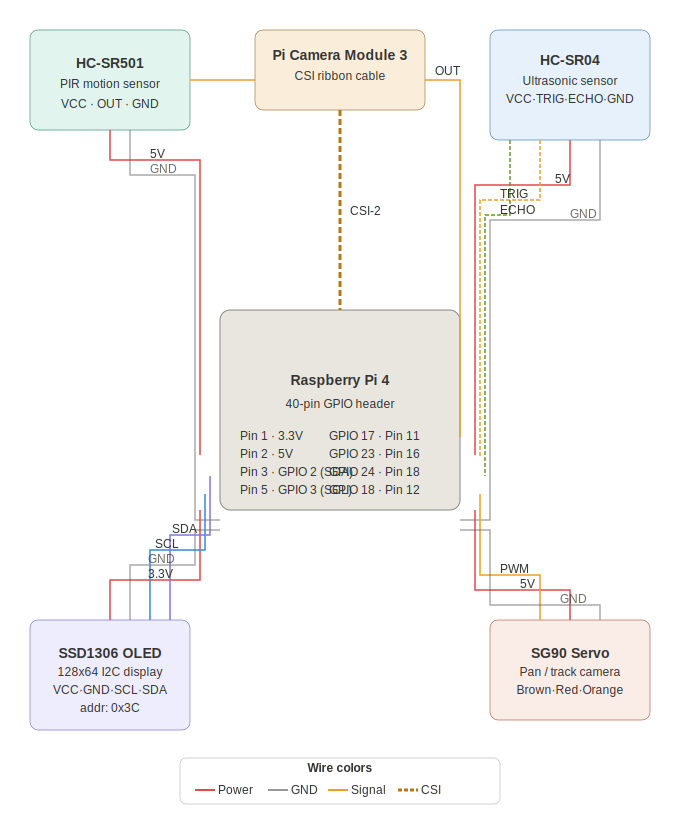

# Autonomous Perimeter Surveillance System

A Raspberry Pi-based autonomous perimeter surveillance system featuring
multi-sensor fusion, real-time computer vision, servo-based target tracking,
and a live command and control web dashboard.

> Built as a portfolio project targeting embedded systems and autonomous
> sensing roles in defense technology. The sensor fusion architecture and
> multi-modal detection pipeline are directly analogous to concepts used in
> autonomous perimeter monitoring systems in defense and border security.

---

## Demo

[Demo video coming soon]

---

## System Overview

The system fuses three independent sensors to detect and track movement in a
defined perimeter zone. No single sensor is trusted in isolation — a confirmed
detection requires all three sensors to agree simultaneously, mirroring
real-world multi-modal detection pipelines.

PIR Sensor ──┐

├──► Fusion Engine ──► OLED Alert + Servo Track + Dashboard

Ultrasonic ──┤        (3/3)

│

Camera ──────┘

---

## Hardware

| Component | Role |
|---|---|
| Raspberry Pi 4 | Main compute |
| Pi Camera Module 3 | Computer vision (2304x1296) |
| HC-SR501 PIR Sensor | Passive infrared motion detection |
| HC-SR04 Ultrasonic | Distance measurement |
| SG90 Servo Motor | Camera pan / target tracking |
| SSD1306 OLED (128x64) | Local status display |




---

## Features

- **Multi-sensor fusion** — PIR + ultrasonic + camera vision must all agree
  before a threat is confirmed, eliminating false positives from noisy sensors
- **OpenCV motion detection** — background subtraction pipeline with contour
  analysis isolates moving objects and extracts position data
- **Servo target tracking** — servo angle is calculated from the camera
  bounding box centroid and updated on each confirmed detection
- **Live C2 dashboard** — Flask web server streams MJPEG camera feed and
  sensor telemetry over the local network, accessible from any device
- **OLED status display** — real-time threat score and distance displayed
  locally on the device
- **Event logging** — timestamped log of all confirmed detection events with
  sensor state and servo angle

---

## Architecture

See [docs/architecture.md](docs/architecture.md) for a full breakdown of the
sensor fusion pipeline, concurrency model, hardware protocols, design
tradeoffs, and what a production version of this system would look like.

---

## Installation

```bash
git clone https://github.com/MaxsCaretaker/surveillance-system
cd surveillance-system
python3 -m venv venv --system-site-packages
source venv/bin/activate
pip install opencv-python-headless flask adafruit-circuitpython-ssd1306 \
    pillow RPi.GPIO picamera2
```

Enable I2C on the Pi:
```bash
sudo raspi-config
# Interface Options → I2C → Enable
```

---

## Running the System

```bash
source venv/bin/activate
python3 src/dashboard/app.py
```

Open a browser on any device on the same network:

http://Pi-Project.local:5000

---

## Pin Reference

| Component | Pin |
|---|---|
| PIR OUT | GPIO 17 (Pin 11) |
| Ultrasonic TRIG | GPIO 23 (Pin 16) |
| Ultrasonic ECHO | GPIO 24 (Pin 18) |
| Servo Signal | GPIO 18 (Pin 12) |
| OLED SDA | GPIO 2 (Pin 3) |
| OLED SCL | GPIO 3 (Pin 5) |

---

## Built With

- Python 3.13
- OpenCV 4.13
- Flask 3.1
- picamera2
- RPi.GPIO
- Adafruit SSD1306

